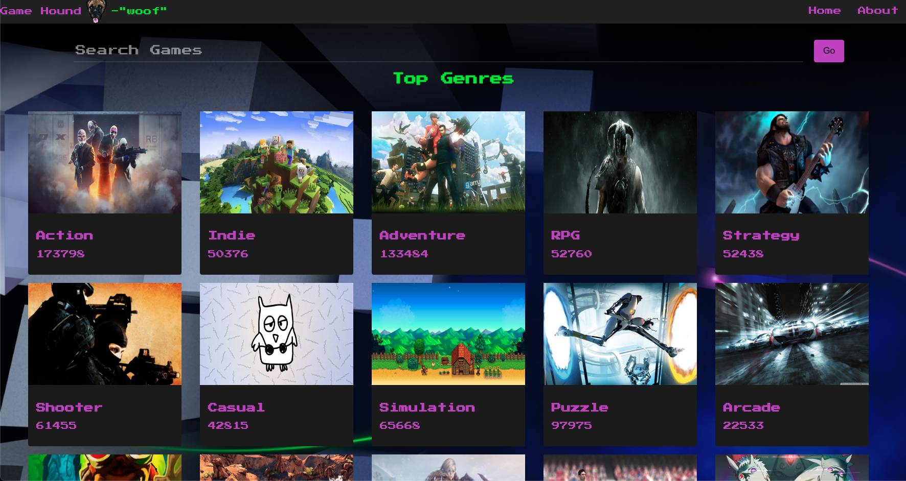

# Game Hound RAWG API

## Date 2/5/23

## By: Noah Vaughn

|
[LinkedIn](https://www.linkedin.com/in/noahvaughn/)
|
[Github](https://github.com/noahdvaughn)
|

---

### **_Description_**

Game Hound is a React-built app that uses the RAWG API to sniff out
games that the user wants to fetch and retrieves the game info to the
user for a treat. Built on week 4 of the General Assembly Software
Immersive program. In other words - "bark bark woof yip yip sniff sniff"

---

### **_Technologies Used_**

- React
- CSS
- HTML
- Javascript

---

### **_Screenshots_**

## Home Page

### **_Future Updates_**

- [ ] Add favorite game

### **_Credits_**

- ["Boxer-dog-8-bit" by abnnett88 on deviantart.com](https://www.deviantart.com/abennett88/art/Boxer-dog-8-bit-432141616)
- [Github pixel art from pixelartmaker.com](http://pixelartmaker.com/art/2b4584429ff7662) -[Linkedin pixel art from pixelartmaker.com](http://pixelartmaker.com/art/0baeb31aedf8e64) -[PS2 inspired wallpaper from adamlbiscuit on reddit.com](https://www.reddit.com/r/gaming/comments/t18sx5/ps2_inspired_desktop_wallpapers_oc/)
